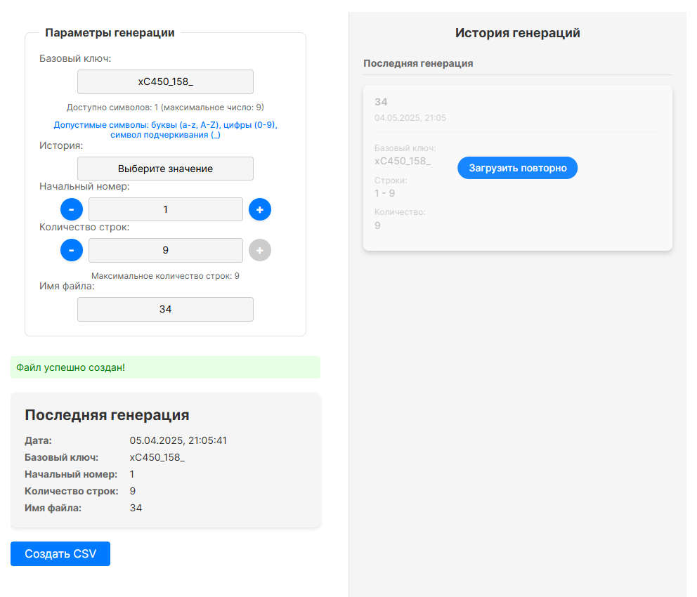

[DEMO](https://csv-creator.vercel.app/)



# CSV Creator

Приложение для генерации CSV файлов с последовательными идентификаторами.

## Описание

CSV Creator - это веб-приложение, которое позволяет генерировать CSV файлы с последовательными идентификаторами на основе базового ключа. Приложение предоставляет удобный интерфейс для настройки параметров генерации и сохраняет историю созданных файлов.

### Основные возможности

- Генерация CSV файлов с последовательными идентификаторами
- Настройка базового ключа, начального номера и количества строк
- Валидация ввода с проверкой допустимых символов
- История генераций с возможностью повторной загрузки (история хранится в localStorage)
- Адаптивный дизайн
- Сохранение истории в localStorage

## Технологии

- React
- CSS Modules
- Vite
- ESLint
- PropTypes

## Требования

- Node.js 14.0 или выше
- npm 6.0 или выше

## Установка

1. Клонируйте репозиторий:
```bash
git clone https://github.com/cactys/csv-creator.git
cd csv-creator
```

2. Установите зависимости:
```bash
npm install
```

## Запуск

### Режим разработки

```bash
npm run dev
```

Приложение будет доступно по адресу: http://localhost:5173

### Сборка для продакшена

```bash
npm run build
```

Собранные файлы будут находиться в директории `dist`

### Предпросмотр собранного приложения

```bash
npm run preview
```

## Использование

1. Введите базовый ключ (допустимые символы: буквы a-z, A-Z, цифры 0-9, символ подчеркивания _)
2. Укажите начальный номер
3. Укажите количество строк
4. Введите имя файла
5. Нажмите кнопку "Создать CSV"

## Структура проекта

```
csv-creator/
├── src/
│   ├── components/
│   │   ├── UI/
│   │   │   ├── ErrorMessage/
│   │   │   ├── InputForm/
│   │   │   └── SuccessMessage/
│   │   ├── CsvGenerator/
│   │   └── GenerationHistory/
│   ├── hooks/
│   ├── utils/
│   ├── _variables.css
│   └── main.jsx
├── public/
├── index.html
├── package.json
├── vite.config.js
└── README.md
```

## Лицензия

MIT
